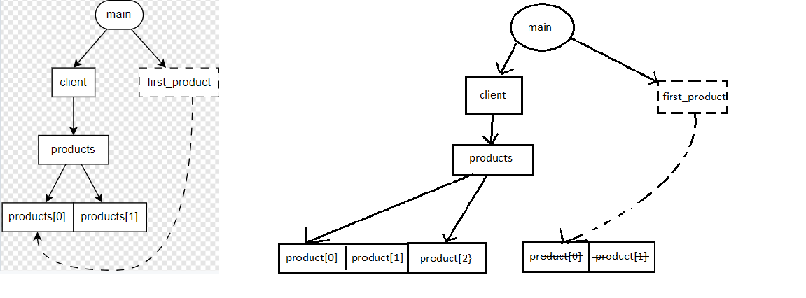

# TP3 - Cycle de vie

## Exercice 1 - Graphes d'ownership (50min)

### Cas A - Copie VS Référence
```cpp
#include <array>

struct Driver
{};

struct Wheel
{};

struct Car
{
    explicit Car(Driver& d)
    : driver { d }
    {}

    Driver&              driver;
    std::array<Wheel, 4> wheels;
};

int main()
{
    auto driver = Driver {};
    auto car = Car { driver };

    auto& first_wheel = car.wheels.front();
    auto  last_wheel = car.wheels.back();
                                                // <-- on est ici
    return 0;
}
```


> 1. Pourquoi n'y a-t-il pas de relation entre `last_wheel` et `wheels[3]` contrairement à `first_wheel` et `wheels[0]` ?

``last_wheel`` fait une copie de ``wheels[3]``
alors que ``first_wheel`` est une référence de ``wheels[0]``, son type est déduit de ``wheels[0]``


### Cas B - Pointeurs-observants
```cpp
struct Worker;

struct Worker
{
    const Worker* manager = nullptr; 
};

int main()
{
    Worker boss;
    Worker cto;
    Worker technician;

    cto.manager = &boss;
    technician.manager = &cto;
                                    // <-- on est ici
    return 0;
}
```


> 1. Dans le graphe d'ownership, comment distingue-t-on un pointeur d'une référence ?

On distingue un pointeur d'une référence avec les traits qui sont en pointillé pour les références
> 2. Comment est représenté un pointeur nul ?

Un pointeur null est représenté par une fleche vers un rond avec une croix
> 3. En termes de code, quelles sont les deux différences principales entre un pointeur-observant et une référence ?

Les deux différences principales entre un pointeur-observant et une référence sont :
- le fait que l'on peut modifier l'element sur lequel le pointeur pointe depuis le pointeur alors que la référence non.
- On peut mettre un pointeur observant à null

### Cas C - Insertions dans un `std::vector`
```cpp
#include <memory>
#include <vector>

struct Product
{};

struct Client
{
    std::vector<Product> products;
};

int main()
{
    auto client = Client {};

    client.products.push_back(Product{});
    client.products.push_back(Product{});

    auto& first_product = client.products.front();
                                                    // <-- on est ici
    client.products.push_back(Product{});
    return 0;
}
```


> Lors d'une insertion, si le buffer mémoire réservé par `std::vector` n'a pas la place de contenir le nouvel élément, alors le contenu du tableau est réalloué dans un tout nouveau buffer de taille suffisante.
> Chaque élément est déplacé de son ancienne adresse mémoire vers la nouvelle.

> 1. Essayez de représenter les transitions dans le graphe d'ownership après le dernier `push_back` si celui-ci déclenchait une réallocation mémoire.



> 2. Quel problème relève-t-on dans le graphe ?
On laisse une dangling référence.

> 3. Modifiez le code ci-dessus afin que `products` contienne des pointeurs ownants. Pensez à ajouter un destructeur à `Client` pour libérer la mémoire allouée dynamiquement.
```cpp
#include <memory>
#include <vector>

struct Product
{};

struct Client
{
    std::vector<Product> products;
    ~Client()
    {
        for(auto product : products)
        {
            delete product;
        }
    };
};

int main()
{
    auto client = Client {};

    client.products.push_back(new Product{});
    client.products.push_back(new Product{});

    auto& first_product = client.products.front();
                                                    // <-- on est ici
    client.products.push_back(new Product{});
    return 0;
}
```

> 4. Redessinez le graphe d'ownership de la question 1, mais en prenant en compte vos changements dans le code.


> 5. Avez-vous toujours le problème relevé à la question 2 ?