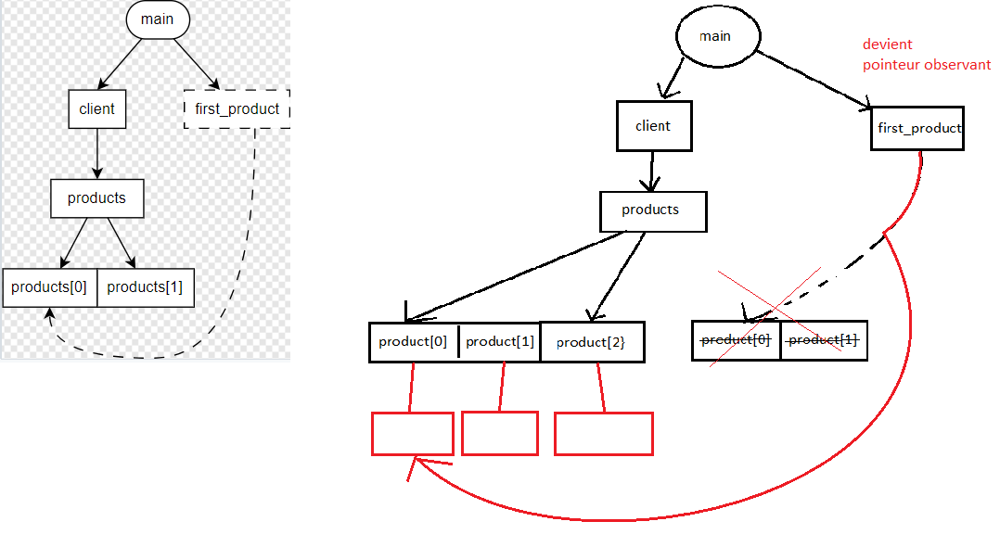

# TP3 - Cycle de vie

## Exercice 1 - Graphes d'ownership (50min)

### Cas A - Copie VS Référence
```cpp
#include <array>

struct Driver
{};

struct Wheel
{};

struct Car
{
    explicit Car(Driver& d)
    : driver { d }
    {}

    Driver&              driver;
    std::array<Wheel, 4> wheels;
};

int main()
{
    auto driver = Driver {};
    auto car = Car { driver };

    auto& first_wheel = car.wheels.front();
    auto  last_wheel = car.wheels.back();
                                                // <-- on est ici
    return 0;
}
```


> 1. Pourquoi n'y a-t-il pas de relation entre `last_wheel` et `wheels[3]` contrairement à `first_wheel` et `wheels[0]` ?

``last_wheel`` fait une copie de ``wheels[3]``
alors que ``first_wheel`` est une référence de ``wheels[0]``, son type est déduit de ``wheels[0]``


### Cas B - Pointeurs-observants
```cpp
struct Worker;

struct Worker
{
    const Worker* manager = nullptr; 
};

int main()
{
    Worker boss;
    Worker cto;
    Worker technician;

    cto.manager = &boss;
    technician.manager = &cto;
                                    // <-- on est ici
    return 0;
}
```


> 1. Dans le graphe d'ownership, comment distingue-t-on un pointeur d'une référence ?

On distingue un pointeur d'une référence avec les traits qui sont en pointillé pour les références
> 2. Comment est représenté un pointeur nul ?

Un pointeur null est représenté par une fleche vers un rond avec une croix
> 3. En termes de code, quelles sont les deux différences principales entre un pointeur-observant et une référence ?

Les deux différences principales entre un pointeur-observant et une référence sont :
- le fait que l'on peut modifier l'element sur lequel le pointeur pointe depuis le pointeur alors que la référence non.
- On peut mettre un pointeur observant à null

### Cas C - Insertions dans un `std::vector`
```cpp
#include <memory>
#include <vector>

struct Product
{};

struct Client
{
    std::vector<Product> products;
};

int main()
{
    auto client = Client {};

    client.products.push_back(Product{});
    client.products.push_back(Product{});

    auto& first_product = client.products.front();
                                                    // <-- on est ici
    client.products.push_back(Product{});
    return 0;
}
```


> Lors d'une insertion, si le buffer mémoire réservé par `std::vector` n'a pas la place de contenir le nouvel élément, alors le contenu du tableau est réalloué dans un tout nouveau buffer de taille suffisante.
> Chaque élément est déplacé de son ancienne adresse mémoire vers la nouvelle.

> 1. Essayez de représenter les transitions dans le graphe d'ownership après le dernier `push_back` si celui-ci déclenchait une réallocation mémoire.


> 2. Quel problème relève-t-on dans le graphe ?

On laisse une dangling référence.

> 3. Modifiez le code ci-dessus afin que `products` contienne des pointeurs ownants. Pensez à ajouter un destructeur à `Client` pour libérer la mémoire allouée dynamiquement.
```cpp
#include <memory>
#include <vector>

struct Product
{};

struct Client
{
    std::vector<Product> products;
    ~Client()
    {
        for(auto product : products)
        {
            delete product;
        }
    };
};

int main()
{
    auto client = Client {};

    client.products.push_back(new Product{});
    client.products.push_back(new Product{});

    auto& first_product = client.products.front();
                                                    // <-- on est ici
    client.products.push_back(new Product{});
    return 0;
}
```

> 4. Redessinez le graphe d'ownership de la question 1, mais en prenant en compte vos changements dans le code.



> 5. Avez-vous toujours le problème relevé à la question 2 ?

non car on utilise plus une référence mais un pointeur observant


## Exercice 2 - La meilleure signature (15min)

1. Remplacez les `XX` par les bons types, de manière à ce que le programme compile et affiche `10 42`.

```cpp
#include <iostream>

int add(int a, int b)
{
    return a + b;
}

void add_to(int& a, int b)
{
    a += b;
}

int main()
{
    int x = 10;
    int y = add(x, x);
    add_to(y, 22);
    std::cout << x << " " << y << std::endl;
    return 0;
}
```
2. Modifiez si besoin les types des paramètres dans les fonctions ci-dessous pour que le passage soit le plus efficace et le plus sécurisé possible.  
Vous pouvez vous aider des commentaires pour comprendre comment les fonctions utilisent leurs paramètres.
```cpp
// Return the number of occurrences of 'a' found in string 's'.
int count_a_occurrences(const std::string& s);

// Update function of a rendering program.
// - dt (delta time) is read by the function to know the time elapsed since the last frame.
// - errors is a string filled by the function to indicate what errors have occured.
void update_loop(const float& dt, std::string& errors_out);

// Return whether all numbers in 'values' are positive.
// If there are negative values in it, fill the array 'negative_indices_out' with the indices
// of these values and set its size in 'negative_count_out'.
// ex: auto res = are_all_positive({ 1, -2, 3, -4 }, negative_indices, negative_count);
//    -> res is false, since not all values are positive
//    -> negative_indices contains { 1, 3 } because values[1] = -2 and values[3] = -4
//    -> negative_count is 2
bool are_all_positives(const std::vector<int>& values, std::vector<int>& negative_indices_out, size_t& negative_count_out);

// Concatenate 'str1' and 'str2' and return the result.
// The input parameters are not modified by the function.
std::string concatenate(const std::string& str1, const std::string& str2);
```
## Exercice 3 - Gestion des resources (55min)

Vous allez créer un logiciel permettant de gérer les salariés de votre entreprise.

Dans votre logiciel, vous devez connaître pour chaque salarié :
- son nom et prénom,
- son salaire mensuel,
- les autres salariés dont il est manager.

Chaque salarié travaille pour un seul et unique département (la R&D, le marketing, etc).

En tant que chef d'entreprise, vous voulez utiliser ce logiciel pour réaliser les actions suivantes :
1. lister tous les salariés,
2. lister tous les départements,
3. lister les personnes appartenant à un département précis,
4. lister tous les managers,
5. lister les subordonnés d'un manager,
6. embaucher un nouveau salarié,
7. licencier un salarié,
8. changer un salarié de département,
9. augmenter le salaire d'une personne,
10. afficher la somme totale payée pour les salaires par département.

### 1. Architecture (15min)

Dans votre programme, vous aurez les classes suivantes :
- `HRSoftSystem` : représente le système et toutes les données sur lesquelles il opère
- `Employee` : représente un employé
- `Department` : représente un département

On vous propose trois architectures différentes pour le programme :

**Architecture A**


**Architecture B**


**Architecture C**


Pour chacune d'entre elles, vous indiquerez les opérations que le programme devrait effectuer pour satisfaire chacun des besoins cités plus haut, sans jamais introduire de dangling-reference.

**Architecture A**
1. check dans la collection d'employé
2. check la collection des département
3. dans la collection d'un département check les références vers les employés
4. pour chaque employé, verifier si on a une référence qui pointe sur un autre employé
5. 
6. ajouter un employé a la collection d'employé
7. mettre le pointeur observant du déparetment vers l'employé a null, pareil pour ses manager et licencier l'employé
8. créer une référence du nouveau déparetment vers l'employé et supprimer l'ancien
9. selectionner l'employé et augmenter son salaire
10. pour chaque employé d'un département sommer le salaire faire ca pour chaque département

**Architecture B**
1. pour chaque département verifier la collection d'employé
2. check la collection de département 
3. dans un département check la collection d'employé
4. pour chaque département verifier pour chaque employé si elles ont des pointeurs observant vers d'autres employés
5. pour chaque département verifier pour chaque employé si elles ont des pointeurs observant vers d'autres employés et quels employés
6.  
7.
8.
9.
10.
**Architecture C**
1. 
2. 
3. 
4. 
5. 
6. 
7.
8.
9.
10.